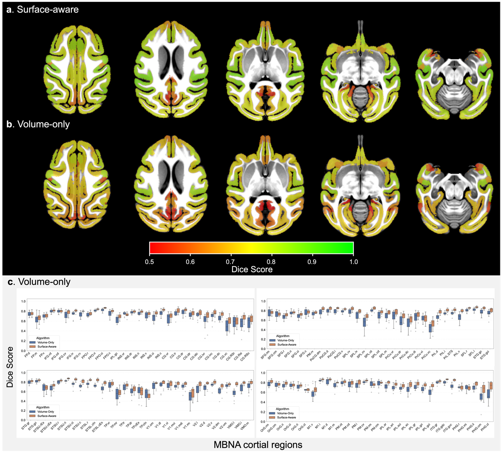

# Surface-Aware Volumetric Registration for MacaSurfer / FireANTs

This repository extends the FireANTs GPU registration framework with **Surface-Aware Volumetric Registration** for MacaSurfer-style cortical analysis workflows. The algorithmic description follows the work associated with DOI: `10.64898/2026.06.14.732101`.

The goal is to improve cortical localization during volumetric registration. Purely volume-based registration and smoothing may blur or misalign cortical areas because cortical fields that are far apart along the folded cortical sheet can be close in Euclidean volume space. This project addresses that limitation by augmenting a symmetric diffeomorphic volumetric registration objective with a surface-aware loss that penalizes the distance between deformed subject and template cortical surfaces.

The resulting deformation field is therefore constrained by both volumetric image similarity and cortical surface geometry, while regularization terms maintain smooth and stable volumetric transformations.

## Motivation: Why Volume-Only Registration Falls Short for Cortical Alignment

Standard volumetric registration methods optimize image similarity based solely on voxel intensities. While effective for subcortical structures, this approach has a fundamental limitation in the cortex: cortical regions that are far apart along the folded cortical sheet can be spatially adjacent in 3D Euclidean space (e.g., opposite banks of a sulcus). A purely volume-based loss function has no notion of cortical geometry and may therefore blur or misalign these regions, collapsing sulcal banks or pulling unrelated cortical areas together. This leads to suboptimal anatomical correspondence, particularly for surface-based analyses that require precise cortical alignment.

Surface-aware registration addresses this by adding a geometric constraint: the deformed subject cortical surface must remain close to the template cortical surface throughout the optimization. This extra loss term constrains the volumetric deformation field to respect cortical folding anatomy, yielding deformation fields that produce better cortical alignment while still maintaining high volumetric image similarity.



**Figure 1. Surface-Aware vs. Volume-Only Registration.** Visual comparison of parcellation alignment with surface-aware (a) and volume-only registration (b). Individual volumetric parcellations were projected to the template space using nonlinear deformation fields estimated by the two registration approaches and visualized in the template volume. Compared with volume-only registration, the surface-aware method shows improved global cortical conformity and better local overlap across most cortical regions, indicating more accurate alignment with cortical anatomy. (c) Boxplots of Dice similarity coefficients for 124 cortical parcels registered to the template. The Surface-Aware strategy (orange) consistently outperforms the Volume-Only approach (blue) across most regions.

## Overview

Given a moving/source subject and a fixed/template target, the pipeline jointly uses:

- 3D anatomical volumes in NIfTI format;
- optional cortical surfaces in GIFTI format;
- optional volumetric labels for label propagation;
- optional cortical ROI labels for surface-loss weighting.

The registration optimizes a multi-scale symmetric deformation model. The objective combines:

| Term | Purpose |
|---|---|
| Volumetric image similarity | Align anatomical intensity patterns between source and target volumes |
| Surface-aware loss | Align source and target cortical surface geometry |
| Displacement regularization | Encourage smooth deformation fields |
| Forward/reverse consistency | Improve symmetry and inverse consistency of the deformation |

## Repository Structure

```text
surf_fireants/
├── register_with_surf.py          # Main registration script
├── pyproject.toml                 # Python package metadata and dependencies
├── fireants/
│   ├── registration/
│   │   ├── affine.py              # Initial affine alignment with optional surface loss
│   │   └── greedy.py              # Multi-scale symmetric deformable registration
│   ├── neuio/
│   │   ├── gifti.py               # GIFTI surface and label I/O
│   │   └── nifti.py               # NIfTI volume I/O
│   ├── utils/
│   │   ├── mesh.py                # Mesh deformation and surface-aware loss
│   │   └── warp_export.py         # Deformation field export (FSL/ANTS format)
│   ├── losses/                    # Image similarity losses
│   ├── interpolator/              # Grid sampling utilities
│   └── solver/                    # Affine and nonlinear warp solvers
└── fused_ops/                     # Optional fused CUDA operations
```

## Method Summary

The main entry point is `register_with_surf.py`.

First, the source and target volumes are loaded and normalized using nonzero voxels. If cortical surfaces are provided, they are loaded from GIFTI files and transformed into the corresponding voxel coordinate space using the associated NIfTI affine matrices.

An initial affine transform is estimated before nonlinear optimization. When surfaces are available, this affine stage also includes a surface alignment term.

The nonlinear registration then optimizes forward and reverse deformation fields over multiple spatial scales. At each scale, the algorithm computes image similarity, surface distance, displacement regularization, and forward/reverse consistency losses. The optimized transform is used to warp the source volume, optional labels, and optional cortical surface into the target space.

## Installation

A CUDA-enabled PyTorch environment is recommended.

```bash
conda create -n surf-fireants python=3.9 -y
conda activate surf-fireants
pip install -e .
```

The base project dependencies include PyTorch, SimpleITK, nibabel, NumPy, SciPy, scikit-image, matplotlib, tqdm, pandas, Hydra, and pytest.

The main surface-aware script also uses MONAI and PyTorch3D:

```bash
pip install monai pytorch3d
```

PyTorch3D installation may depend on the local CUDA and PyTorch versions.

Optional fused CUDA operations can be built from `fused_ops/` if faster custom kernels are desired:

```bash
cd fused_ops
python setup.py build_ext
python setup.py install
cd ..
```

## Inputs

### Required inputs

| Argument | Format | Description |
|---|---|---|
| `--src_vol` | `.nii` / `.nii.gz` | Source or moving volume |
| `--trg_vol` | `.nii` / `.nii.gz` | Target or fixed/template volume |

### Optional inputs

| Argument | Format | Description |
|---|---|---|
| `--src_surf` | `.gii` | Source cortical surface |
| `--trg_surf` | `.gii` | Target/template cortical surface |
| `--src_lbl` | `.nii` / `.nii.gz` | Source volumetric label map for propagation |
| `--trg_lbl` | `.nii` / `.nii.gz` | Target volumetric label map; currently loaded but not central to output generation |
| `--src_cort` | `.label.gii` / `.gii` | Source surface ROI labels |
| `--trg_cort` | `.label.gii` / `.gii` | Target surface ROI labels |
| `--src_mask` | `.nii` / `.nii.gz` | Source brain mask for region-of-interest cropping |
| `--trg_mask` | `.nii` / `.nii.gz` | Target brain mask for region-of-interest cropping |
| `--crop_margin` | int (default: 7) | Voxel margin around mask when cropping |

For the default MSE surface loss, source and target surfaces should have corresponding vertices and matching topology. If the surfaces are not vertex-wise corresponding, the surface loss should be adapted, for example by using a Chamfer-style loss.

## Outputs

| Argument | Format | Description |
|---|---|---|
| `--out_vol` | `.nii` / `.nii.gz` | Source volume warped into target space |
| `--out_surf` | `.gii` | Source surface warped into target physical space |
| `--out_lbl` | `.nii` / `.nii.gz` | Source label map propagated into target space |
| `--out_warp` | `.nii` / `.nii.gz` | Optional forward warp output |
| `--out_inv_warp` | `.nii` / `.nii.gz` | Optional inverse warp output |
| `--warp_format` | `fsl` or `ants` (default: `fsl`) | Deformation field output format |

`out_vol` and `out_lbl` are saved using the target volume affine. `out_surf` is saved as a GIFTI surface using the deformed source vertices and the original source surface faces.

## Basic Usage

```bash
python register_with_surf.py \
  --src_vol source_T1.nii.gz \
  --trg_vol template_T1.nii.gz \
  --src_surf source.white.surf.gii \
  --trg_surf template.white.surf.gii \
  --out_vol source_to_template.nii.gz \
  --out_surf source_white_to_template.surf.gii
```

Optional labels and ROI files can be supplied when label propagation or ROI-weighted surface alignment is needed:

```bash
python register_with_surf.py \
  --src_vol source_T1.nii.gz \
  --trg_vol template_T1.nii.gz \
  --src_surf source.white.surf.gii \
  --trg_surf template.white.surf.gii \
  --src_lbl source_labels.nii.gz \
  --trg_lbl template_labels.nii.gz \
  --src_cort source.cortex.label.gii \
  --trg_cort template.cortex.label.gii \
  --out_vol source_to_template.nii.gz \
  --out_lbl source_labels_to_template.nii.gz \
  --out_surf source_white_to_template.surf.gii
```

The default multi-scale schedule is:

```text
--scales 4 2 1
--iterations 800 600 400
--learning_rate 0.4
```

These parameters can be adjusted for faster testing or more intensive optimization.

### Mask-based cropping

When brain masks are available, the registration can be restricted to the brain region to reduce memory usage and speed up computation:

```bash
python register_with_surf.py \
  --src_vol source_T1.nii.gz \
  --trg_vol template_T1.nii.gz \
  --src_mask source_brain_mask.nii.gz \
  --trg_mask template_brain_mask.nii.gz \
  --crop_margin 7 \
  --src_surf source.white.surf.gii \
  --trg_surf template.white.surf.gii \
  --out_vol source_to_template.nii.gz \
  --out_surf source_white_to_template.surf.gii \
  --out_warp forward_warp.nii.gz \
  --out_inv_warp inverse_warp.nii.gz \
  --warp_format fsl
```

The deformation field is estimated on the cropped domain and then extrapolated back to the full image domain via boundary-padded displacement sampling. Supported warp formats are `fsl` (relative displacement in scaled voxel coordinates) and `ants` (world-coordinate displacement via SimpleITK).

## Implementation Notes

- `register_with_surf.py` controls data loading, registration, and output writing.
- `fireants/registration/affine.py` estimates the initial affine transform.
- `fireants/registration/greedy.py` implements the symmetric multi-scale deformable registration loop.
- `fireants/utils/mesh.py` implements mesh deformation, physical/voxel coordinate conversion, and `MeshDeformLoss`.
- `fireants/utils/warp_export.py` converts internal deformation grids to standard FSL or ANTS displacement field formats.
- `fireants/neuio/gifti.py` and `fireants/neuio/nifti.py` provide GIFTI and NIfTI I/O utilities.

The default loss configuration uses local normalized cross-correlation for images, MSE for surface vertices, diffusion regularization for displacement fields, and a forward/reverse consistency penalty.

## Citation

If you use this registration method in your research, please cite:

> Wei, Y. et al. *MacaSurfer: unified surface-volume mapping of the macaque brain across the lifespan.* 2026.06.14.732101 Preprint at https://doi.org/10.64898/2026.06.14.732101 (2026).

If you use the underlying FireANTs framework, please also cite:

```bibtex
@article{jena2024fireants,
  title={FireANTs: Adaptive Riemannian Optimization for Multi-Scale Diffeomorphic Registration},
  author={Jena, Rohit and Chaudhari, Pratik and Gee, James C},
  journal={arXiv preprint arXiv:2404.01249},
  year={2024}
}
```

## License

See `LICENSE` for licensing and redistribution terms.
